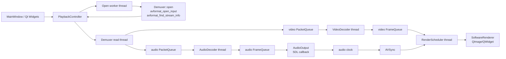

# Qt/FFmpeg Video Player

这是一个基于 Qt Widgets、FFmpeg 和 SDL2 的桌面视频播放器个人项目。项目重点放在播放器核心链路：解封装、解码、音频输出、视频渲染调度、播放控制、seek 边界处理、音视频同步和网络流异常恢复。

当前版本支持本地文件播放，以及 RTSP / RTMP / HLS / HTTP-FLV 等常见网络输入；播放管线采用多线程模块拆分，通过 Packet / Frame 两级有界队列进行线程间解耦，并使用 serial 机制处理 seek 后的新旧数据边界。

## Features

- 打开本地媒体文件。
- 打开 RTSP、RTMP/RTMPS、HLS、HTTP-FLV、HTTP/HTTPS 媒体 URL。
- 播放、暂停、进度跳转、音量、静音、全屏、倍速。
- 暂停状态下支持前进/后退逐帧。
- 打开媒体时使用后台线程执行 FFmpeg 输入探测，避免 UI 冻结。
- 网络流打开和读取配置超时，断流后按指数退避重连。
- 视频渲染目前使用软件渲染：FFmpeg frame -> sws_scale -> QImage -> QWidget 绘制。
- 音频输出使用 SDL2 callback，音频重采样使用 libswresample。
- 音视频同步采用 Audio Master：音频时钟作为主时钟，视频侧调整显示时机并丢弃落后帧。

## Architecture



## Source Map

- `main.cpp`: 初始化 SDL audio、FFmpeg network、Qt 应用和日志规则。
- `mainwindow.h/.cpp`: 窗口、菜单、底部控制栏、Opening 覆盖提示、状态栏和用户输入。
- `playbackcontroller.h/.cpp`: 播放状态机和模块编排，负责 open/close/play/pause/seek/reconnect。
- `demuxer.h/.cpp`: FFmpeg 输入打开、流选择、读 packet 线程、网络选项和 seek。
- `decoder.h/.cpp`: 音频/视频解码线程，消费 PacketQueue，输出 FrameQueue。
- `PacketQueue.h`: packet 有界队列，带 serial，用于识别 seek 后的新旧数据边界。
- `FrameQueue.h`: frame 有界队列，frame 入队时携带 packet serial。
- `audiooutput.h/.cpp`: SDL2 音频设备、重采样、音量、倍速和音频时钟。
- `renderscheduler.h/.cpp`: 视频显示调度，按源帧率或音频主时钟计算显示时机。
- `avsync.h/.cpp`: Audio Master 同步策略，参考 ffplay 的 target delay 思路。
- `softwarerenderer.h/.cpp`: 软件渲染，把 AVFrame 转成 QImage 并在 QWidget 中绘制。
- `networkoptions.h`: RTSP/RTMP/HTTP/HLS 打开参数、超时和重连选项。

## Build

当前 `CMakeLists.txt` 使用本机开发环境中的 FFmpeg 和 SDL2 路径：

- `D:/ffmpeg`
- `D:/SDL2-devel-2.30.5-mingw/SDL2-2.30.5/x86_64-w64-mingw32`

本机验证命令：

```powershell
D:\qt\6.7.2\mingw_64\bin\qt-cmake.bat -S . -B build-mingw -G "MinGW Makefiles"
cmake --build build-mingw -j 8
```

如果换机器构建，需要先安装 Qt 6 MinGW、FFmpeg development package 和 SDL2 development package，并按本机环境调整 CMake 中的依赖路径。

## Manual Verification

核心验证项：

- 打开本地 MP4，UI 在 Opening 阶段不冻结。
- 播放、暂停、音量、静音、全屏可用。
- 拖动进度条到前中后多个位置，画面没有旧帧残留，声音能跟上。
- 暂停后执行 `+1帧` 和 `-1帧`，画面按帧刷新。
- 打开网络流，断流时能给出错误提示并进入重连流程。

## Current Limitations

- 当前渲染路径以软件渲染为主，OpenGL renderer 仍是后续扩展方向。
- 主界面采用 Qt Widgets；仓库中的 QML 控件和图标资源尚未接入当前构建。
- CMake 依赖路径仍偏本机环境，跨机器构建时需要调整。
- 当前验证以手动功能场景为主，后续可补充核心模块的自动化测试。
