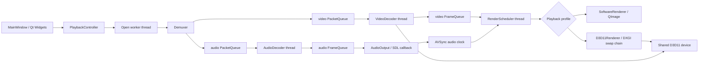

# Qt/FFmpeg Video Player

一个基于 Qt Widgets、FFmpeg 与 SDL2 的桌面音视频播放器。项目将解封装、解码、音频输出、视频调度、音视频同步和网络重连拆分为独立模块，并通过带 serial 的有界队列处理 seek 后的新旧数据边界。

## Rendering Profiles

播放器在打开媒体前选择并固定一个 profile。切换 profile 会停止当前管线、销毁 renderer 与解码器，并在有媒体时重新打开 URL；不支持在同一条播放管线内临时切换。

- `Software`: CPU 软解 + `SoftwareRenderer`（`sws_scale` 到 `QImage`）。这是跨平台兜底路径。
- `D3D11`: Windows 路径。应用创建一个带 `D3D11_CREATE_DEVICE_VIDEO_SUPPORT` 的共享 device，FFmpeg 的 D3D11VA 解码器与 `D3D11Renderer` 共用它。解码帧保留在 GPU，renderer 从解码纹理数组的对应 slice 用 `CopySubresourceRegion` 拷到可采样 NV12 纹理，经 HLSL 做 YUV-to-RGB 转换后交给 DXGI swap chain 呈现。

D3D11 device 创建、FFmpeg 硬件设备初始化或 codec 的 D3D11 格式协商失败时，播放器会自动重建为 `Software` profile 并重新打开当前媒体。D3D11 profile 的视频 `FrameQueue` 容量为 4，避免持有过多解码 surface；软件 profile 保持默认容量 16。

共享 immediate context 同时启用了 `ID3D11Multithread::SetMultithreadProtected(TRUE)`，且 FFmpeg 的 `lock` / `unlock` 回调与 renderer 共用 `D3D11Context` 的 mutex，避免解码线程与 GUI 呈现线程并发访问 device context。

## Architecture



## Source Map

- `mainwindow.h/.cpp`: Qt window, controls, profile selection and profile rebuild.
- `playbackcontroller.h/.cpp`: playback state machine, module lifetime, D3D11-to-software fallback and queue sizing.
- `demuxer.h/.cpp`: FFmpeg input opening, stream selection, packet reader, network options and seek.
- `decoder.h/.cpp`: decoder threads; `VideoDecoder` imports the app-owned D3D11 device and forwards hardware frames unchanged.
- `d3d11context.h/.cpp`: shared D3D11 device, immediate context and synchronization lock.
- `d3d11renderer.h/.cpp`: native Qt child window, DXGI swap chain, GPU NV12 copy and HLSL rendering.
- `softwarerenderer.h/.cpp`: software fallback renderer.
- `PacketQueue.h` / `FrameQueue.h`: bounded packet/frame queues carrying seek serials.
- `audiooutput.h/.cpp`, `renderscheduler.h/.cpp`, `avsync.h/.cpp`: audio playback, video scheduling and audio-master synchronization.

## Build

The project is Windows-only because the primary GPU profile links Direct3D 11. `CMakeLists.txt` links `d3d11`, `dxgi` and `d3dcompiler`, with Qt Widgets as the only Qt module dependency.

The current local dependency paths are:

- `D:/ffmpeg`
- `D:/SDL2-devel-2.30.5-mingw/SDL2-2.30.5/x86_64-w64-mingw32`

```powershell
D:\qt\6.7.2\mingw_64\bin\qt-cmake.bat -S . -B build-mingw -G "MinGW Makefiles"
cmake --build build-mingw -j 8
```

## Manual Verification

- Verify normal playback, pause, seek, frame stepping, speed change and fullscreen in both profiles.
- In D3D11 profile, play H.264/H.265 at 1080p and 4K; verify aspect ratio, BT.601/BT.709 color, resize and seek behavior.
- Play for several minutes and seek repeatedly in D3D11 profile to confirm decoder surfaces are not exhausted.
- On a machine without usable D3D11VA or with an unsupported codec, verify the player switches to Software and continues opening the same media.
- Compare CPU use for the same 4K media in both profiles; D3D11 should avoid GPU-to-CPU frame download.
